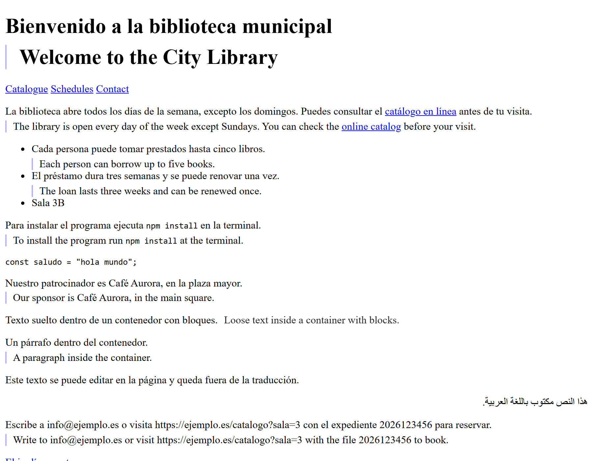
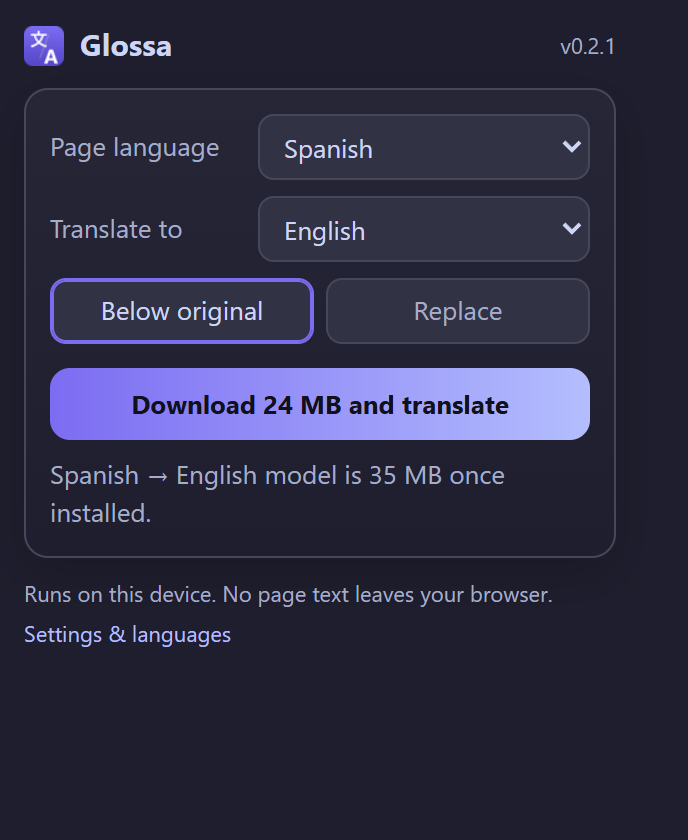
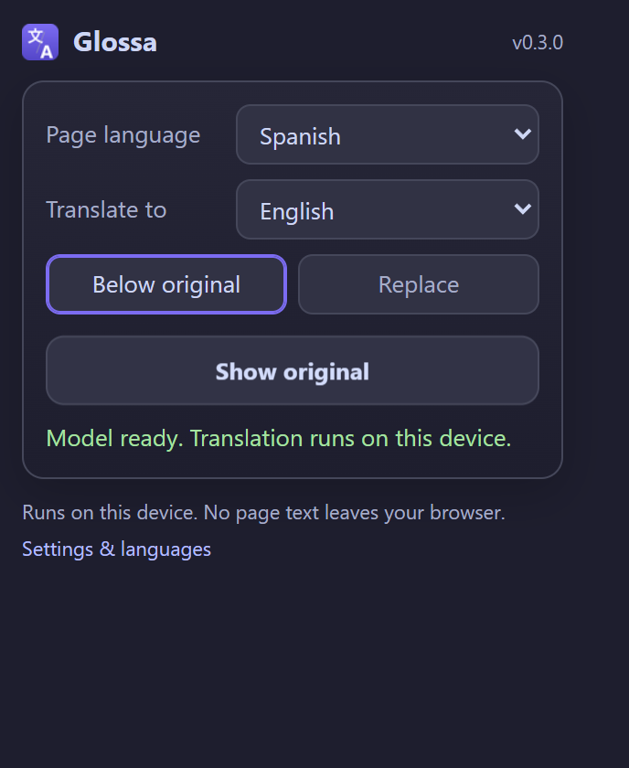
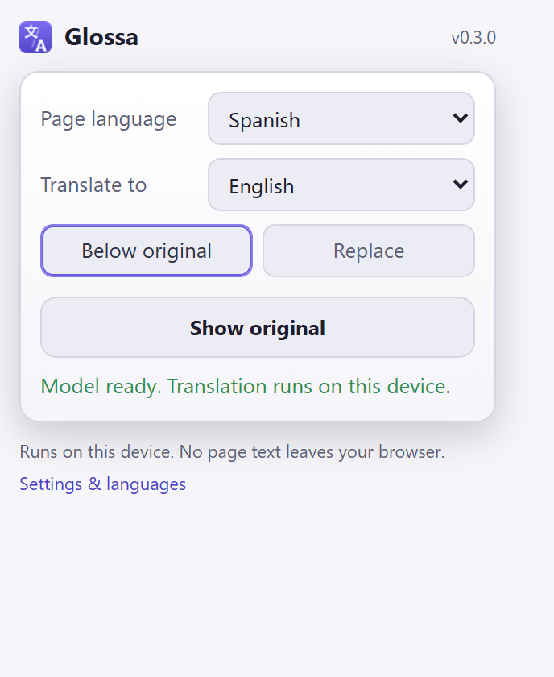

<p align="center">
  
</p>

<h1 align="center">Glossa</h1>

<p align="center">Translate web pages on your own device. No cloud, no account, no telemetry.</p>

<p align="center">
  
  
  
  
</p>

Glossa is a browser extension that translates pages without sending the text anywhere. It runs the same neural translation engine that Firefox uses for its built-in translator, compiled to WebAssembly, inside your browser. Page text never leaves the machine.

## Why another translator

Every popular translator extension, including the ones marketed on privacy, ships with a cloud engine as the default. The one that leads the market keeps its source closed and had a public data leak in 2025. Browser built-in translators are convenient but you're trusting the vendor's word about what gets uploaded.

Glossa takes the opposite approach. There is no cloud engine in the code at all, so there is nothing to opt out of. The extension holds no permission to read websites on its own. It touches a page only when you ask, and the only hosts it can ever contact are the three Mozilla-operated locations that serve the language models.

<p align="center">
  
</p>
<p align="center">
  
  
</p>
<p align="center">
  
</p>

## What it does

- Translates a whole page, keeping the original in place and showing the translation under each block. A replace mode is one click away, with the original as a hover tooltip.
- Detects the page language locally. You can override it.
- Keeps inline links and formatting inside sentences, and leaves code blocks, brand names marked `translate="no"`, and form fields alone. Web addresses, email addresses and reference numbers come back exactly as they went in.
- Follows content that arrives later, so infinite scroll and single-page apps get translated too. It notices revealed panels, text the page rewrites in place, open shadow roots, and frames from the same site.
- Handles a page written in more than one language. A quoted paragraph that declares its own `lang` is translated with that language's model, or left alone if you do not have it.
- Restores the original page without a reload.
- Translates a selection from the context menu, and translates what you have typed into a text box from the same menu.
- Per-site rules. Turn Glossa off for a host and it will not even look at its pages. List the languages you read and those pages are never offered.
- Downloads each language model once (roughly 20 to 45 MB per direction), verifies it against Mozilla's published hashes, and keeps it on disk. You see the size before anything downloads and can delete models from the options page.

Glossa's own interface follows your browser's language: English, Spanish, German, French, Japanese and Chinese are included, and anything missing falls back to English.

Coverage follows Firefox's catalog: about 60 languages, all pivoting through English. A Spanish to French translation therefore runs two models.

## Install

Glossa is not in any store yet. Load it unpacked from a release ZIP or from a local build. Every
release asset ships a `.sha256` sidecar, so you can check a download before you trust it.

**Chrome, Edge, Brave, and other Chromium browsers** (Chrome 116 or newer)

1. Download `glossa-chrome-vX.Y.Z.zip` from the [releases page](https://github.com/SysAdminDoc/Glossa/releases) and extract it to a folder you will keep. The browser loads the extension from that folder on every start.
2. Open `chrome://extensions`, turn on Developer mode, click Load unpacked, and pick the folder.

A `.crx` is attached as well, for anyone who would rather keep one file. Chromium refuses to install
a self-signed CRX downloaded from the web, so the ZIP is the path that works.

**Firefox** (Firefox 142 or newer)

1. Download `glossa-firefox-vX.Y.Z.zip`.
2. Open `about:debugging#/runtime/this-firefox`, click Load Temporary Add-on, and choose the ZIP. Temporary add-ons are removed when Firefox closes. A signed build for permanent installs is on the roadmap.
3. Open the Glossa popup. Firefox treats host permissions as optional and a temporary add-on starts with none at all, so the popup shows an "Allow model downloads" button the first time. One click and downloads work, with no reload.

## What to expect

Two honest comparisons, because you will notice both.

**Speed.** Glossa is slower than Firefox's own built-in translator on the same machine, and it always
will be. Firefox runs the engine's matrix multiplication through `WebAssembly.mozIntGemm`, which is
only available to privileged browser code, and it can use threads. An extension gets neither, so
Glossa runs a single-threaded SIMD build. Expect a long article to take a few seconds rather than
under one.

**Quality.** These are Mozilla's models, and on Mozilla's own evaluation they average about 4 COMET22
points below Google Translate across the 105 released pairs, and never come out ahead. Most pairs are
close enough that you will not care. The weakest are English to Marathi, Hindi, Arabic, Telugu and
Thai, and Marathi to English, where the gap is 7 to 9 points. Mozilla publishes the numbers at
[mozilla.github.io/translations/final-evals](https://mozilla.github.io/translations/final-evals/).

**Hardware.** The engine needs WebAssembly SIMD: any x86 CPU with SSE4.1 (Intel from 2008, AMD from
2011) or a 64-bit ARM machine. It never shipped for 32-bit ARM, so old Android phones cannot run it.

## Build from source

Requirements: Node 24 or newer, Python 3 with Pillow (only for regenerating icons).

```bash
npm install
npm run engine:fetch    # downloads the 5 MB Bergamot WASM binary and verifies both hashes
npm run build           # writes dist/chrome, dist/firefox, and one ZIP per target
```

`npm run verify` runs the typecheck, lint, unit tests, and build. `npm run smoke` builds a test variant with a loopback host permission and runs the headless Chromium test, which downloads the Spanish to English model and translates a fixture page through the real popup. `npm run smoke:firefox` does the same in the system Firefox through Selenium (`pip install selenium`; geckodriver is fetched automatically). `npm run screenshots` refreshes the images above the same way. If your firewall blocks outbound traffic per binary, point the smoke at a Chromium build it does allow with `GLOSSA_CHROMIUM_PATH`.

`npm run verify:release` runs everything: the checks above, both browser smokes and the axe pass. `GLOSSA_SMOKE_PIVOT=1` adds a Spanish to French run, which goes through English and downloads a second model. `npm run smoke:a11y` runs axe against the popup, the options page and a translated page, and fails on any violation.

`npm run bump 0.3.0` moves every version string and dates the changelog heading. `npm run release`
builds the artifacts with their SHA-256 sidecars and a CRX; `npm run release:publish` also tags the
commit and creates the GitHub release. The CRX signing key is generated into a gitignored
`glossa.pem` on first use, and keeping that file is what keeps the extension id stable.

## For store reviewers

**Single purpose.** Glossa translates the text of a web page into another language, on the user's own
machine. It does nothing else.

**Why each permission is there.**

- `activeTab` and `scripting`: the content script is injected into the tab the user invokes Glossa
  on, and only then. There is no content script declared for any site.
- `storage` and `unlimitedStorage`: settings, and the language models, which are tens of megabytes
  each and live in the browser's Cache storage.
- `contextMenus`: the "Translate this page" and "Translate selection" entries.
- `offscreen` (Chrome only): the translation engine is a WebAssembly module in a Web Worker, and a
  service worker cannot keep one alive. Firefox's background page hosts it directly and the Firefox
  package contains no offscreen code at all.
- Three host permissions, all Mozilla-operated: `firefox.settings.services.mozilla.com` for the
  model catalog, `firefox-settings-attachments.cdn.mozilla.net` and Mozilla's model bucket on
  `storage.googleapis.com` for the model files themselves.
- `<all_urls>` is optional and never requested at install. It is asked for, from a click, only when
  a user adds an "always translate" rule for a site, and only for that site.

**About the model files.** The engine is a WebAssembly binary inside the package; it is never
fetched at runtime. What is fetched is data: the language model files Mozilla publishes for its own
translator. Each file is checked against the SHA-256 hash in Mozilla's catalog before it is used,
whichever of the two sources served it, and nothing is fetched until a user asks for a language.

**What is sent.** Nothing but those model requests. Page text is translated in a Web Worker inside
the extension and never leaves the machine. There is no analytics, no telemetry, no account, no
remote configuration and no error reporting.

**Rebuilding the package.** Every release carries `glossa-source-vX.Y.Z.zip` with the full source,
the lockfile, and a `BUILDING.txt` naming the exact steps and the engine hashes. The packages are
byte-reproducible: `npm ci --ignore-scripts && npm rebuild esbuild && npm run engine:fetch &&
npm run build` produces ZIPs whose SHA-256 matches the published ones exactly, which
`npm run verify:source` checks by unpacking the archive and doing it.

## How it works

```
page  ──(activeTab click)──▶  content script
                                 │  block-level segments, inline tags kept
                                 ▼
                            background
                                 │
              Chrome: offscreen document   Firefox: background page
                                 │
                        Web Worker running Bergamot (WASM, SIMD, single thread)
                                 │  models from Cache storage
                                 ▼
                       translated HTML fragments back into the page
```

The engine binary ships inside the package. Models are data. The catalog at `firefox.settings.services.mozilla.com` says which files a pair needs and publishes a SHA-256 hash for each. The bytes then come from one of two Mozilla-operated sources that hold identical files: the Remote Settings CDN at `firefox-settings-attachments.cdn.mozilla.net`, or Mozilla's model registry bucket on Google Cloud Storage. The CDN answers 406 to any browser whose user agent says "Chrome", so Chromium browsers end up on the bucket after one refused request. Every file is verified against the catalog hash before it is stored, whichever source served it. All three locations are listed in the manifest and nothing else is.

## Privacy

- Translation happens in a Web Worker inside the extension. No page text is sent anywhere.
- The extension has no host permission for websites. It injects its script only into the tab you invoke it on.
- Network access is limited to three Mozilla-operated locations, and only for model downloads. You can verify this in the manifest and in the browser's network log. On Chromium browsers the model bytes come from a Mozilla bucket hosted on Google Cloud Storage, so Google's edge sees a download of a static file for a language pair. A self-hosted mirror option is on the roadmap for people who want to avoid even that.
- No analytics, no crash reporting, no account, no update checks beyond what the browser does for any extension.

## Licenses

Glossa is MIT. The Bergamot engine (`bergamot-translator.js` and `bergamot-translator.wasm`) and the language models are Mozilla Public License 2.0; the license text ships in every build as `LICENSE.bergamot.txt`. See [vendor/bergamot/README.md](vendor/bergamot/README.md) for how the engine is pinned and updated.

## Acknowledgements

The engine and models come from Mozilla's [translations](https://github.com/mozilla/translations) project, which grew out of the EU-funded Bergamot project at the University of Edinburgh and partners. Glossa would not exist without that work.
